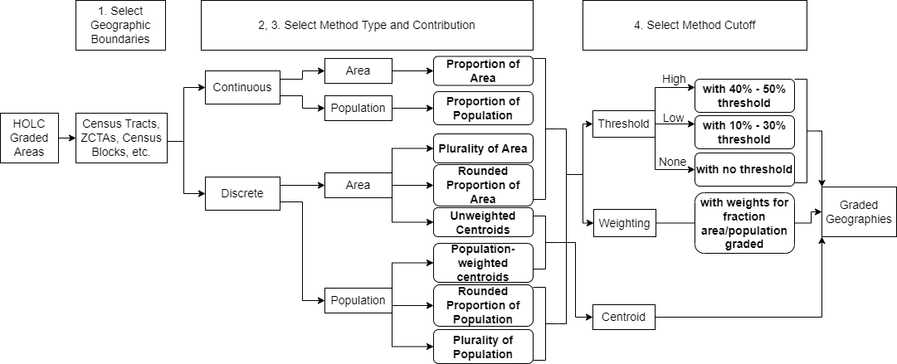
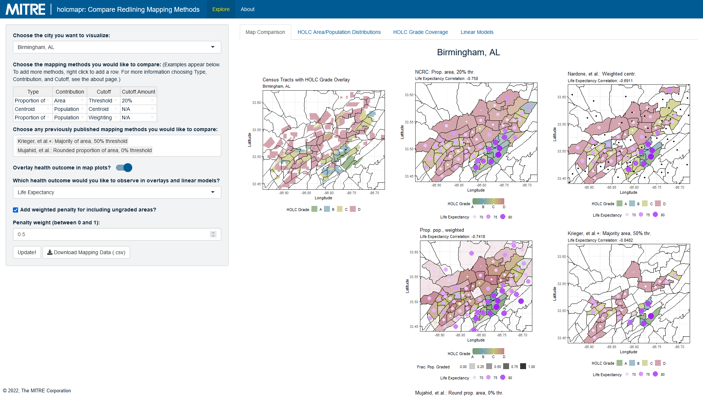

# holcmapr: An Application for Comparing Redlining Mapping Methodologies

## Overview

holcmapr is an R package that provides a Shiny application for implementing and comparing methods of mapping Home Owners' Loan Corporation (HOLC) redlining map neighborhoods to present-day census tracts for all redlined cities. To learn more about redlining and look through the original HOLC maps, please see the [Mapping Inequality website](https://dsl.richmond.edu/panorama/redlining/).

## Installation

To install the development version of this package from GitHub:

``` r
# uncomment the next line if you don't have devtools installed
# install.packages("devtools")
devtools::install_github("mitre/holcmapr")
```

## Comparing Redlining Mapping Methodologies

holcmapr compares published methods and logical extensions of published methods by 3 aspects: method type, contribution, and cutoff in the following workflow:



These can be customized for comparison for census tracts within holcmapr's main application.

Published methods include: 
- Population-weighted centroids ([Nardone, et al. 2020](https://pubmed.ncbi.nlm.nih.gov/31999951/), [Mitchell, et al. 2022](https://pubmed.ncbi.nlm.nih.gov/35504083/)) 
- Proportion of area, filtered by people and housing units ([Crossney and Bartelt 2005](https://www.tandfonline.com/doi/abs/10.1080/10511482.2005.9521555)) 
- Proportion of area, 20% threshold ([NCRC 2020](https://ncrc.org/holc-health/), [Motairek, et al. 2022](https://pubmed.ncbi.nlm.nih.gov/35798451/)) 
- Plurality of area, 50% threshold, remove water areas ([Krieger, et al. 2020](https://www.ncbi.nlm.nih.gov/pmc/articles/PMC7287548/), [Krieger, et al. 2020](https://pubmed.ncbi.nlm.nih.gov/32219369/), [Wright, et al. 2022](https://pubmed.ncbi.nlm.nih.gov/35603845/), [Li and Yuan 2022](https://pubmed.ncbi.nlm.nih.gov/35286901/)) 
- Unweighted area centroids ([Wilson 2020](https://www.tandfonline.com/doi/full/10.1080/01944363.2020.1759127), [Erikson, et al. 2022](https://jamanetwork.com/journals/jamanetworkopen/fullarticle/2791603), [Shaker, et al. 2022](https://link.springer.com/article/10.1007/s10460-022-10340-3)) 
- Highest graded area ([Li and Yuan 2020](https://pubmed.ncbi.nlm.nih.gov/34178163/)) 
- Total proportion of area, 50% threshold ([Lynch, et al. 2021](https://www.ncbi.nlm.nih.gov/pmc/articles/PMC8099638/)) 
- Plurality of area, 0% threshold ([Lane, et al. 2022](https://pubs.acs.org/doi/full/10.1021/acs.estlett.1c01012)) 
- Plurality of area, 50% threshold ([Lee, et al. 2022](https://pubmed.ncbi.nlm.nih.gov/33102679/)) 
- Rounded proportion of area, 0% threshold ([Mujahid, et al. 2022](https://www.pnas.org/doi/abs/10.1073/pnas.2110986118)) 
- Proportion of area, 0% threshold ([Linde, et al. 2022](https://pubmed.ncbi.nlm.nih.gov/35639415/))

## Usage and Features

holcmapr's main function is a Shiny app, which can be accessed by running the following in R:

``` r
library(holcmapr)

run_holcmapr()
```

You should then see the holcmapr app below:



holcmapr allows users to compare: 
- Comparison of city boundaries to original HOLC neighborhoods, and the alignment of HOLC graded areas and populations 
- Selected methodology mapping results 
- HOLC neighborhood coverage by each method 
- Univariate linear association fits by each method, including p-value and R\^2 value, for a selected health outcome (life expectancy, mental health, or physical health)

The results with mapping for each method are also available for download by CSV, for use outside the application, such as research contexts.

## Data Sources & Citation

If you're using `holcmapr` or any of its content, please cite us and let us know you're using it at opensource@mitre.org. To see citation information for `holcmapr`, enter the following in the console window:

```r
citation("holcmapr")
```

which outputs citations used in default format:

```
  De los Santos H, Bezold C, Jiang K, Chen J, Okechukwu C (2022). holcmapr:
  Compare Mapping Methodologies for Home Owners' Loan Corporation (HOLC)
  Redlining Maps. R package version 0.0.1.

  Robert K. Nelson, LaDale Winling, Richard Marciano, Nathan Connolly, et al.,
  “Mapping Inequality,” American Panorama, ed. Robert K. Nelson and Edward L.
  Ayers, accessed November 28, 2022,
  https://dsl.richmond.edu/panorama/redlining/

  GeoNames (2022). GeoNames Postal Code Files. Accessed: 2022-11-28.
  <https://download.geonames.org/export/zip/>

  United States Census Bureau (2010). Centers of Population (2010). Accessed:
  2022-11-28.
  <https://www.census.gov/geographies/reference-files/time-series/geo/centers-population.2010.html>

  Arias E, Escobedo LA, Kennedy J, Fu C, Cisewski J. U.S. Small-area Life
  Expectancy Estimates Project: Methodology and Results Summary. National
  Center for Health Statistics. Vital Health Stat 2(181). 2018.

  PLACES. Centers for Disease Control and Prevention. Accessed 2022-11-28.
  https://www.cdc.gov/places
```

Instructions for citations related to pieces of the package can be found in that format as well.

The data sources used in this package are:
- [Mapping Inequality](https://dsl.richmond.edu/panorama/redlining/): Redlining Spatial Files
- [GeoNames Postal Code Files](https://download.geonames.org/export/zip/): Mapping cities to counties
- [US Census Bureau Centers of Population (2010)](https://www.census.gov/geographies/reference-files/time-series/geo/centers-population.2010.html): Population centers for census tracts, for population-weighted centroid method
- [USALEEP Life Expectancy](https://www.cdc.gov/nchs/nvss/usaleep/usaleep.html): Life expectancy census tract estimates
- [CDC Places](https://www.cdc.gov/places): Mental health and physical health census tract estimates

## Contact & Attribution

For any questions or concerns, please contact the maintainer for this package, Hannah De los Santos ([hdelossantos\@mitre.org](mailto:hdelossantos@mitre.org)).

©2021 The MITRE Corporation. ALL RIGHTS RESERVED.
